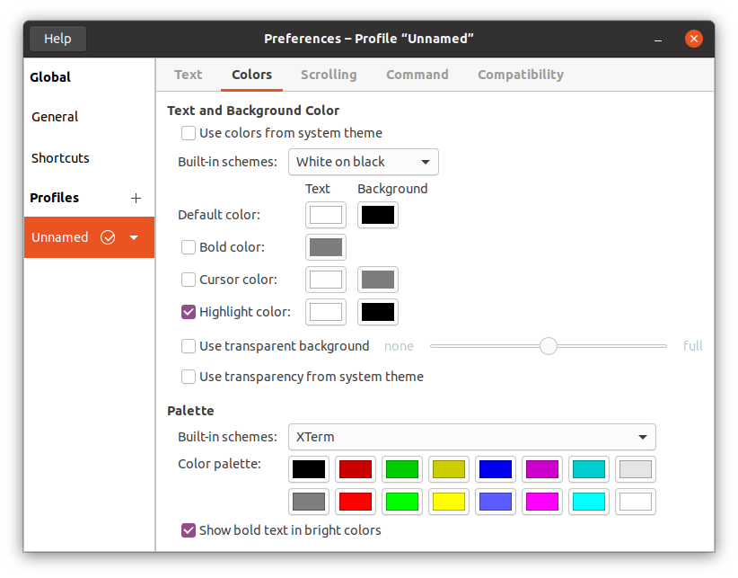
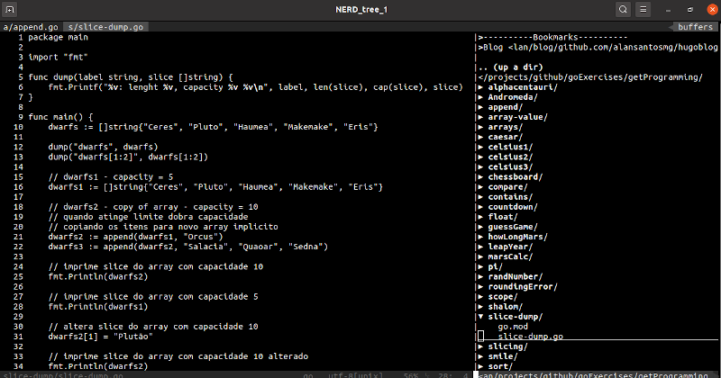

## Vim blackjack color scheme

Simple vim theme with minimalist colors. Ideal for black and white terminal color scheme.


### Installation

Install with `plug` plugin-manager. Set in your `.vimrc`file: 


```vim

Plug 'alansantosmg/blackjack.vim'

```

Then `:PlugInstall`.

### Usage

Set in your `.vimrc`file: 

```vim

colorscheme blackjack 

syntax on  		  	"Enable syntax highlight (mandatory)
 
set number  		   	"Enable line numbers (optional)
set hlsearch        	"Enable highlight search (optional)
set gcr=a:blinkon0  	"Disable cursor blinking" (optional)


```

### For best results

#### If you are using Ubuntu + Gnome Terminal

Set your terminal preferences as below: 



#### If you are using Airline status bar

Set the minimalist airline theme in your `.vimrc` file: 

```vim

let g:airline_theme = 'minimalist'

```


### Screenshot




### Thanks

This colorscheme is a fork of [Hans Fugal bw theme](http://fugal.net/vim/colors/bw/vim). 


